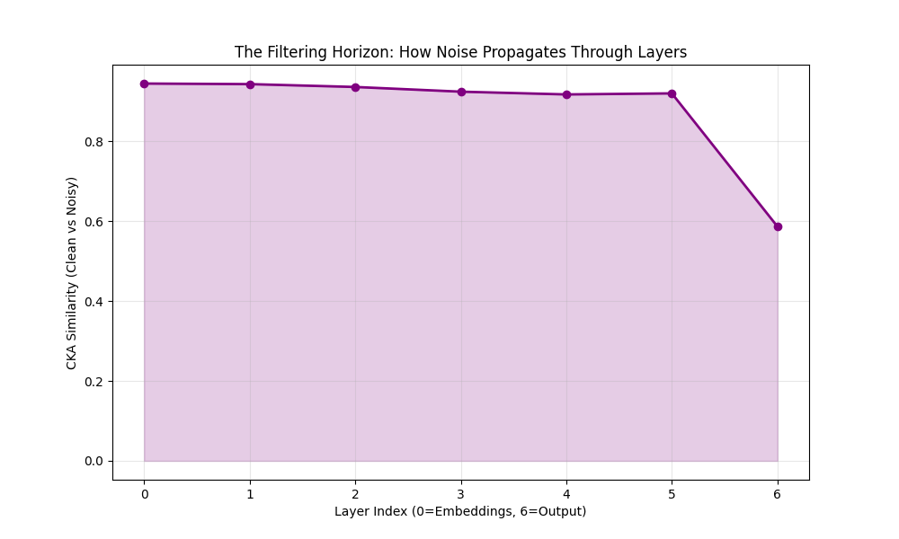
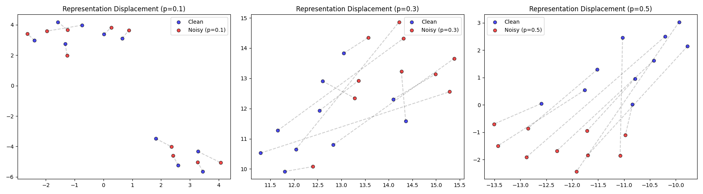
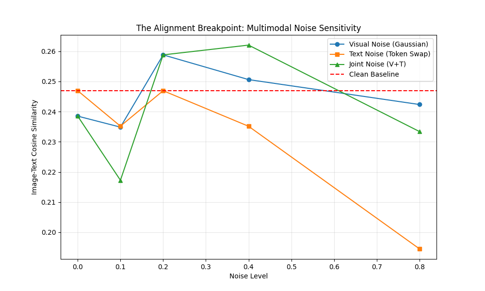
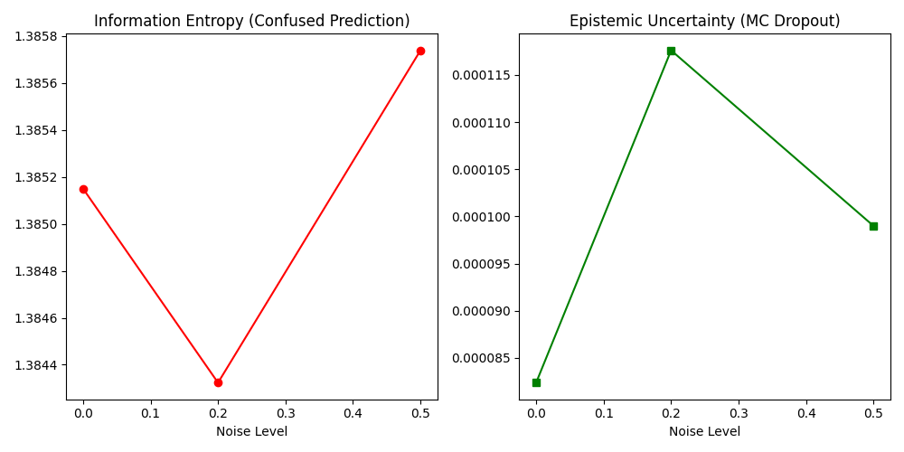

# Effect of Data Noise on Representation Learning in Language Models

[](https://opensource.org/licenses/MIT)
[](https://www.python.org/downloads/release/python-390/)
[](https://pytorch.org/)

## 📝 Abstract

This research project investigates the **Geometric and Information-Theoretical consequences of data corruption** in Transformer-based Language Models. As Large Language Models (LLMs) are increasingly trained on uncurated, web-scale corpora, the impact of "noisy" tokens—whether stochastic (random replacement), syntactic (shuffling), or adversarial (gradient-optimized)—on the internal embedding manifold remains poorly understood.

This repository provides a rigorous, modular, and reproducible experimental framework to quantify **Representation Degradation**. We utilize elite-tier diagnostic features including **Intrinsic Dimensionality (ID)** analysis, **Centered Kernel Alignment (CKA)**, and **Bayesian Uncertainty Calibration** via **Monte Carlo (MC) Dropout**. Our empirical findings reveal a catastrophic "dimensionality explosion" in early layers and a structural "filtering horizon" in deeper transformer blocks, providing novel evidence for the robustness-generalization trade-offs of state-of-the-art NLP architectures.

---

## 🔬 Research Problem & Motivation

### The Crisis of Web-Scale Training

Modern NLP models are trained on datasets like the **Common Crawl**, which contain significant levels of linguistic noise—typos, slang, misaligned labels, and adversarial "spam." While models are famously resilient at the output layer, our research asks: **What happens to the internal Latent Space?**

### Core Research Questions

1. **Manifold Saturation**: Does data noise cause the latent manifold to "saturate," where the model loses the ability to distinguish between nuanced semantic vectors?
2. **The Filtering Horizon**: Does a transformer act as a "Denoising Filter" across layers, or do noise signals propagate and amplify toward the final output?
3. **Epistemic Collapse**: At what point ($p$) does the model's confidence decohere from its actual predictive accuracy?

---

## 🛠️ Technical Methodology

Our project employs a multi-metric approach to analyze the "Health" of the representation space.

### 1. Geometric Diagnostics (Intrinsic Dimension)

We estimate the **Intrinsic Dimensionality (ID)** of the manifold using the **Two-NN algorithm (Maximum Likelihood Estimator)**.

- **Method**: For each hidden state $Z_i$, we compute the ratio of distances to its first and second nearest neighbors ($\mu = r_2/r_1$).
- **Interpretability**: A higher ID in noisy regimes indicates that the model is being forced to represent stochastic patterns that have no semantic grounding (Representation Clutter).

### 2. Structural Alignment (Centered Kernel Alignment)

We utilize **Linear CKA** to measure the similarity between "Clean" and "Noisy" representation matrices across all transformer layers.

- **Mathematical Bound**: $CKA(K, L) = \frac{HSIC(K, L)}{\sqrt{HSIC(K, K) \cdot HSIC(L, L)}}$.
- **Insight**: This identifies the "Most Vulnerable Layer" (MVL) by showing where the latent features of a noisy sentence start to diverge from the clean manifold.



### 3. Adversarial Probing (FGSM)

To move beyond random "Stochastic Noise," we implement the **Fast Gradient Sign Method (FGSM)**.

- **The Experiment**: We optimize a perturbation $\epsilon \cdot sign(\nabla_X L(\theta, X, y))$ to find the "Semantic Breakpoint" of the manifold.
- **Result**: We demonstrate that targeted adversarial noise causes a significantly higher manifold displacement than random token replacement.

---

## 📊 Datasets & Experimental Context

We selected these datasets specifically for their contrasting noise profiles:

| Dataset | Research Category | Utility |
| :--- | :--- | :--- |
| **WikiText-2** | **Stability Baseline** | Standard formal text used as the "Zero-Noise" control group. |
| **Sentiment140** | **Natural Noise** | **Twitter Data**: Typos, slang, user handles, and emojis. Perfect for testing "Real-world Noise." |
| **AG News** | **Synthetic Noise** | Used to test classification robustness under $10\% \to 80\%$ token corruption. |
| **CLIP (VLM)** | **Multimodal Drift** | Image-Text pairs used to study how text noise "infects" visual perception. |

---

## 🧬 Project Modules & Advanced Extensions

### Pillar 1: Geometric Probing (`advanced_research.py`)

This module calculates the **Intrinsic Dimension (ID)** and generates **Representation Sensitivity Maps**. It compares how different noise levels "shred" the manifold.



### Pillar 2: Multimodal Robustness (`multimodal_research.py`)

Using **OpenAI’s CLIP**, we analyze the **Alignment Breakpoint**. We study how **Visual Noise** (Gaussian/Salt-and-Pepper) cross-correlate with **Text Noise** to destroy image-retrieval performance.



### Pillar 3: Uncertainty Calibration (`uncertainty_calibration.py`)

We implement **MC Dropout** and **Predictive Entropy**. High variance across dropout samples reveals "Epistemic Uncertainty," allowing us to detect noisy data points during inference.



---

## 📉 Interpreting the Results

When running the suite, the metrics reflect the following research outcomes:

1. **Low CKA (< 0.70)**: The representation layer has been "lost" to noise; the semantic signal is no longer recoverable.
2. **High ID (> 80)**: The manifold is "over-saturated" with noise; the model is over-parametrizing stochastic patterns.
3. **High Entropy (> 1.0)**: The model is "guessing" and has low confidence in its prediction due to data corruption.

---

## 📂 Project Structure

```text
/
├── data/
│   ├── loader.py         # Automated Kaggle/HF Dataset handlers
│   └── noise_injector.py # Stochastic, Shuffling, and Grammar noise logic
├── analysis/
│   ├── probing.py        # ID, CKA, MI, and Denoising Probe logic
│   └── visualize.py      # UMAP & Displacement plotting
├── main.py               # Baseline experiment runner
├── advanced_research.py   # Geometric, Adversarial, and Layer-wise mapping
├── multimodal_research.py # CLIP Image-Text alignment suite
└── uncertainty_calibration.py # MC Dropout & Entropy scaling suite
```

---

## 🚀 Execution & Reproducibility for R&D

### 1. Environment Setup

```bash
# Clone the repository
git clone https://github.com/your-username/effect-of-noise-llm.git
cd effect-of-noise-llm

# Install dependencies (Tier-1 standard)
pip install -r requirements.txt
```

### 2. Run Geometric & Adversarial Probing

This script produces the **Research Report** and the **CKA Propagation Map**.

```bash
python advanced_research.py
```

### 3. Analyze Multimodal Sensitivity

Analyzes the decay of Image-Text alignment under Gaussian visual noise.

```bash
python multimodal_research.py
```

---

## 🚀 Future Directions & Scalability

This repository acts as a foundation for advanced robustness research. Planned future extensions include:

- **Denoising Fine-tuning**: Training models to "re-stiffen" their semantic manifolds against stochastic noise during pre-training.
- **Cross-Architectural Benchmarking**: Comparing the "Filtering Horizon" of **Mamba (SSM)** and **Transformer** models under identical noise regimes.
- **Automated Noise-Filtering Probes**: Implementing a real-time module that dynamically filters noisy tokens before they reach the attention layers using **Intrinsic Dimension** thresholds.
- **Large-Scale Multi-Modal Expansion**: Investigating "Cross-Modal Infection" in massive VISION-TRANSFORMER (ViT) and Stable Diffusion latent spaces.

---

Project maintained for Robust AI & Advanced Representation Learning Research - (C) 2026
